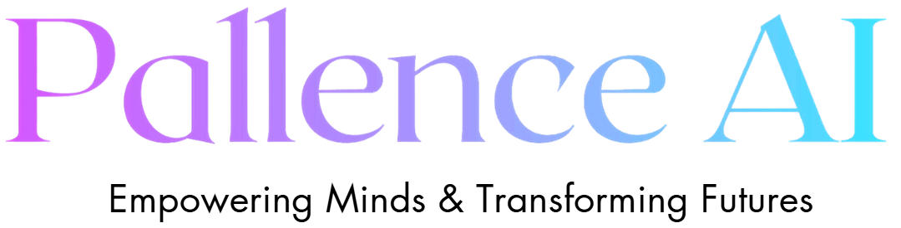

# Deep Learning Mastery: Build Your AI Foundation



Welcome to the course! This README file provides clear instructions on how to download the course material and run the code for all sections. You can complete the course using two methods: Google Colab (recommended) or a local Anaconda environment. Follow the instructions below to get started.

## Course Material
All the course materials, including code and notebooks, can be found in the following GitHub repository:

[Course GitHub Repository](https://github.com/DrSridharPalle/Course-1-Deep-Learning-Mastery-Build-Your-AI-Foundation)

### How to Download the Material
1. Visit the repository: [Course GitHub Repository](https://github.com/DrSridharPalle/Course-1-Deep-Learning-Mastery-Build-Your-AI-Foundation)
2. Click on the green **Code** button.
3. Select **Download ZIP** to download the repository to your local machine.
4. Extract the downloaded ZIP file to access the notebooks and code files.

## Two Ways to Complete the Course

### 1. Using Google Colab (Recommended)
Google Colab allows you to run the course notebooks directly in your browser without installing anything locally. This is the recommended approach for the best experience.

#### Steps to Run on Google Colab:
1. Open the GitHub repository and navigate to the notebook you want to run.
2. Click on the notebook file (.ipynb) and copy its URL.
3. Open [Google Colab](https://colab.research.google.com/).
4. Select **File > Open Notebook**, then click on the **GitHub** tab.
5. Paste the URL of the notebook or search for the repository.
6. Once the notebook is loaded, follow the instructions in the notebook to install the required packages.

#### Required Libraries:
At the beginning of each notebook, run the following command to install the necessary libraries:

```python
!pip install tensorflow numpy pandas matplotlib
```

- **tensorflow** (tested with version 2.13.0 and above)
- **numpy** (tested with version 1.23.0 and above)
- **pandas** (tested with version 1.4.0 and above)
- **matplotlib** (tested with version 3.5.0 and above)
- **notebook** (use version below 7.0.0 if necessary)

#### Notes:
- Ensure you run the setup cells in each notebook before running the code.
- If you encounter any errors, restart the Colab runtime and re-install the packages as needed.

### 2. Using a Local Environment (Anaconda)
If you prefer to run the course locally, follow these steps to set up an environment using Anaconda.

#### Steps to Set Up the Local Environment:
1. Download and install [Anaconda](https://www.anaconda.com/).
2. Open the Anaconda Prompt and create a new environment:

   ```bash
   conda create -n dl_course_env python=3.8 -y
   ```

3. Activate the environment:

   ```bash
   conda activate dl_course_env
   ```

4. Navigate to the directory where you downloaded the course material.
5. Install the required packages using `requirements.txt`:

   ```bash
   pip install -r requirements.txt
   ```

#### Known Issues:
- Some parts of the code (e.g., GPU operations) may not work locally on Windows due to compatibility issues with the latest TensorFlow and GPU drivers.
- To avoid errors and compatibility issues, it is highly recommended to use Google Colab for GPU support and the latest libraries.

## Final Notes
- If you encounter any issues, feel free to reach out through the Q&A section of the Udemy course.
- Happy learning and coding!
